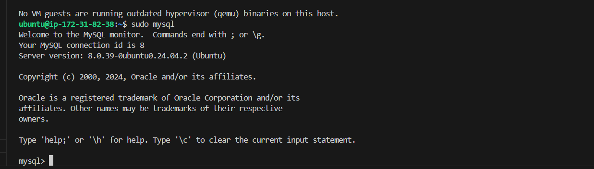

# LAMP Stack Server Setup Guides

Here’s a step-by-step guide on how to set up a LAMP stack (Linux, Apache, MySQL, PHP) on an AWS EC2 **t2.micro** instance with **Ubuntu 24.04 LTS** for a DevOps project.

## Prerequisites:
1. AWS account
2. SSH key pair for EC2 access (created during the EC2 instance setup)
3. Terminal

### Step 1: Launch an EC2 Instance
1. **Sign in to AWS Management Console** and go to the **EC2 Dashboard**.
2. Click on **Launch Instance**.
3. **Configure instance**:
   - **Name**: Give your instance a name (e.g., "LAMP Server").
   - **AMI**: Select **Ubuntu 24.04 LTS HVM** (64-bit architecture).
   - **Instance type**: Choose **t2.micro** (eligible for free tier).
   

4. **Key pair**: If you have one, choose it. Otherwise, create a new key pair and download the `.pem` file.
   

5. **Security group**: Create a new security group or use an existing one. Ensure that the following ports are allowed:
   - **SSH (port 22)** – for remote access
   - **HTTP (port 80)** – for web traffic
   - **HTTPS (port 443)** – for secure web traffic (optional)
6. **Launch** the instance.

### Step 2: Connect to the EC2 Instance
1. Open a terminal (or use VSCode Terminal if preferred).
2. Connect to your instance using SSH:

   ```bash
   cd /path/to/your-key.pem
   ```

   ```bash
   ssh -i your-key.pem ubuntu@<your-ec2-public-ip>
   ```
   Replace `/path/to/your-key.pem` with the actual path to your key pair and `<your-ec2-public-ip>` with the EC2 instance public IP.
      
   

## Error: 
   I used the default Security Group that is yet to open Port 22 for SSH connection.
   

## Solution:
   I editted the inbound rule to allow all traffic, which includes port 22, 80, 443 etc, and connection from anywhere. (You could specify the specific ports instead of allowing all traffic.)
   

   Now we are able to successfully connect to the instance.
   
   


### Step 3: Update the Server
   Run the following commands to update your server:
   ```bash
   sudo apt update
   sudo apt upgrade -y
   ```

### Step 4: Install Apache
1. Install **Apache**:
   ```bash
   sudo apt install apache2 -y
   ```
2. Verify Apache is running:
   ```bash
   sudo systemctl status apache2
   ```
  

3. Open your browser and navigate to your EC2 public IP. You should see the Apache default page.
   Or curl http://localhost:80
  
  


### Step 5: Install MySQL
1. Install **MySQL**:
   ```bash
   sudo apt install mysql-server -y
   ```
  

2. Secure MySQL installation:
   ```bash
   sudo mysql
   ```
  

   Follow the prompts to set up the root password, remove anonymous users, disallow remote root login, and more.

   ```bash
   ALTER USER 'root'@'localhost' IDENTIFIED WITH mysql_native_password BY 'PassWord.1';
   ```

3. sudo mysql_secure_installation
   

4. Log in to MySQL to ensure it works:
   ```bash
   sudo mysql -p
   ```
   Enter the root password you created, and you should have access to the MySQL shell.

  


### Step 6: Install PHP
1. Install **PHP** and necessary PHP extensions for Apache and MySQL:
   ```bash
   sudo apt install php libapache2-mod-php php-mysql php-cli -y
   ```
  

2. Check PHP Version
   ```bash
   php -v
   ```
  

3. Restart Apache to load PHP:
   ```bash
   sudo systemctl restart apache2
   ```

### Step 7: Set Up Virtual Hosts 
1. Create a new directory for your website:
   ```bash
   sudo mkdir /var/www/lampproject
   ```

   sudo chown -R $USER:$USER /var/www/lampproject


2. Create a new virtual host file:
   ```bash
   sudo nano /etc/apache2/sites-available/lampproject.conf
   ```
3. Add the following content to configure the virtual host:
   ```apache
   <VirtualHost *:80>
       ServerName lampproject
       ServerAlias www.lampproject
       ServerAdmin webmaster@localhost
       DocumentRoot /var/www/lampproject
       ErrorLog ${APACHE_LOG_DIR}/error.log
       CustomLog ${APACHE_LOG_DIR}/access.log combined
   </VirtualHost>
   ```

  

4. Enable the virtual host:
   ```bash
   sudo a2ensite yourwebsite.conf
   sudo ls /etc/apache2/sites-available
   sudo a2ensite lampproject
   sudo a2dissite 000-default
   sudo apache2ctl configtest
   ```
  

   ```bash
      sudo systemctl reload apache2
   ```
  


### Step 8: Test with HTML scripts
1. Navigate to the project path
   ```bash
   cd /var/www/lampproject
   ```

2. Create an index.html file
   ```bash
   touch index.html
   ```
3. Open and edit the file, then paste the html contents below.   
   ```bash
   nano index.html
   ```
   ```html
   <!DOCTYPE html>
   <html lang="en">
     <head>
         <meta charset="UTF-8">
         <meta name="viewport" content="width=device-width, initial-scale=1.0">
         <title>Test Page</title>
      </head>
      <body>
          <h1>Welcome to Your Test Page</h1>
          <p>This is a simple HTML file for testing purposes.</p>
      </body>
   </html>
   ```
   To view the index.html file contents.
   ```bash
   cat index.html
   ```
  


4. Open the browser to view 
      http://34.239.0.90/
      http://ec2-34-239-0-90.compute-1.amazonaws.com/:80

     
     

### Step 9: Enable PHP on the website
   ```bash
   sudo nano /etc/apache2/mods-enabled/dir.conf
   ```

   ```bash
   <IfModule mod_dir.c>
       DirectoryIndex index.html index.cgi index.pl index.php index.xhtml index.htm
   </IfModule>
   ```

   ```bash
   sudo systemctl reload apache2

   ```
   


### Step 10: Test PHP Installation
1. Create a PHP test file:
   ```bash
   nano /var/www/lampproject/index.php
   ```
2. Add the following content:
   ```php
   <?php
   phpinfo();
   ?>
   ```
3. Save and exit (`Ctrl+X`, `Y`, then `Enter`).

4. In your browser, go to `http://<your-ec2-public-ip>/info.php`. You should see a PHP information page.

5. **Remove PHP info page**:
   For security reasons, delete the PHP info page after testing:
   ```bash
   rm index.php
   ```
   
   
   


